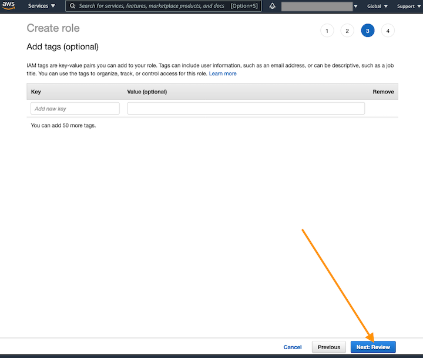
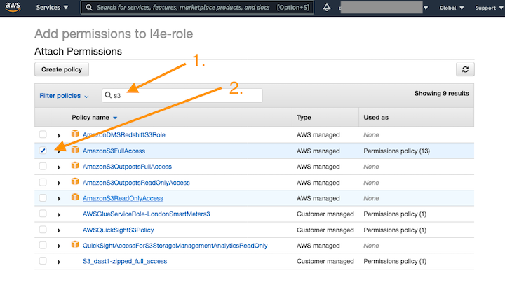

# Amazon Lookout for Equipment IAM Role Configuration Instructions
Amazon Lookout for Equipment is a machine learning (ML) service for monitoring industrial equipment that detects abnormal equipment behavior and identifies potential failures. Lookout for Equipment enables users to implement predictive maintenance programs and to identify suboptimal equipment processes. 


**Pre-requisite:**
Before you can start with Lookout for Equipment, you must sign up for an AWS account and request preview access to the service on the [Amazon Lookout for Equipment Sign-up Page](https://pages.awscloud.com/Amazon-Lookout-for-Equipment-Preview.html). 

Services in AWS, such as Lookout for Equipment, require that you provide credentials when you access them so that the service can determine whether you have permissions to access the resources owned by that service. These set of instructions will guide you through the necessary steps to create and configure an IAM role that you can use with Amazon Lookout for Equipment.

Expected

## Part 1: Create an IAM role.
---
**Step 1:** Navigate to IAM Service from your AWS Console by typing in `IAM` in the search bar. </br>
Click on `IAM` Service once it appears in the drop down menu, like shown:</br>

</br>

**Step 2:** Click on `Roles` and click on `Create Role`: </br>

</br>

**Step 3:** Select `Sagemaker` and click on `Next: Permissions`: </br>

</br>

**Step 4:** Nothing here, just click on `Next: Tags`: </br>

</br>

**Step 5:** Nothing here either, just click on `Next: Review`: </br>

</br>

**Step 6:** Enter `Role name` and click on `Create Role`: </br>

</br>


## Part 2: Attach policies to the created IAM role.
---
**Step 1:** Search for the created IAM role in the search bar and click on it: </br>

</br>

**Step 2:** Click on `Attach Policies`: </br>

</br>

**Step 3:** Search and check-off the following policies: </br>
1. _AmazonS3FullAccess_
2. _IAMFullAccess_

and click `Attach Policies`, like so:</br>


</br>

**Step 4:** Click on `Add inline policy`: </br>

</br>

**Step 5:** Select `JSON` tab and copy-paste the following policy into the window and click on `Review policy`: </br>
```json
{
 "Version": "2012-10-17",
 "Statement": [
     {
         "Sid": "VisualEditor0",
         "Effect": "Allow",
         "Action": "iam:PassRole",
         "Resource": "*"
     },
     {
         "Sid": "VisualEditor1",
         "Effect": "Allow",
         "Action": "lookoutequipment:*",
         "Resource": "*"
     }
    ]
}
```

like so: </br>

</br>

**Step 6:** Fill-in the name in the `Name` field and click on `Create policy`: </br>

</br>

## Part 3: Edit trust relatioship for the created IAM role.
---
### Step 1:

Select `Trust relationships` tab and click on `Edit trust relatioship `:


### Step 2:

Copy-paste the following policy into the window and click on `Update Trust Policy`:

```json
{
  "Version": "2012-10-17",
  "Statement": [
    {
      "Effect": "Allow",
      "Principal": {
        "Service": "lookoutequipment.amazonaws.com"
      },
      "Action": "sts:AssumeRole"
    },
    {
      "Effect": "Allow",
      "Principal": {
        "Service": "sagemaker.amazonaws.com"
      },
      "Action": "sts:AssumeRole"
    }
  ]
}
```

as shown:


**Congratulations!** You just created and configured your IAM role and are now ready to proceed with using Amazon Lookout for Equipment.