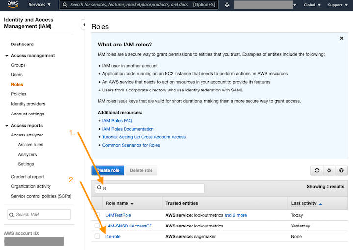
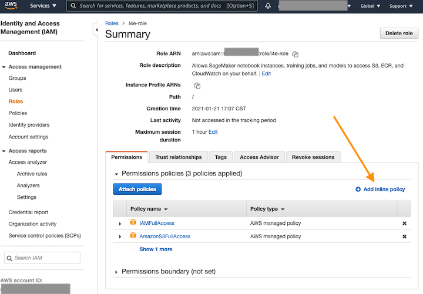

# Amazon Lookout for Equipment IAM Role Configuration Instructions
Amazon Lookout for Equipment is a machine learning (ML) service for monitoring industrial equipment that detects abnormal equipment behavior and identifies potential failures. Lookout for Equipment enables users to implement predictive maintenance programs and to identify suboptimal equipment processes. 


**Pre-requisite:**
Before you can start with Lookout for Equipment, you must sign up for an AWS account and request preview access to the service on the [Amazon Lookout for Equipment Sign-up Page](https://pages.awscloud.com/Amazon-Lookout-for-Equipment-Preview.html). 

Services in AWS, such as Lookout for Equipment, require that you provide credentials when you access them so that the service can determine whether you have permissions to access the resources owned by that service. These set of instructions will guide you through the necessary steps to create and configure an IAM role that you can use with Amazon Lookout for Equipment.

**Expected Time to Complete:** 15 minutes. 

## Part 1: Create an IAM role.

An IAM role is an IAM identity that you can create in your account that has specific permissions. An IAM role is similar to an IAM user, in that it is an AWS identity with permission policies that determine what the identity can and cannot do in AWS. However, instead of being uniquely associated with one person, a role is intended to be assumable by anyone who needs it. Also, a role does not have standard long-term credentials such as a password or access keys associated with it. Instead, when you assume a role, it provides you with temporary security credentials for your role session. 

Here we're going to create and IAM role to delegate access to Amazon Lookout for Equipment from the a SageMaker instance or Console. 


#### Step 1: 
Navigate to IAM Service from your AWS Console by typing in `IAM` in the search bar. Click on `IAM` Service once it appears in the drop down menu, as shown:


#### Step 2:
Click on `Roles` and click on `Create Role`:


#### Step 3:
Select `Sagemaker` and click on `Next: Permissions`:


#### Step 4:
Nothing here, just click on `Next: Tags`:


##### Step 5:
Nothing here either, just click on `Next: Review`:


#### Step 6:
Enter `Role name` and click on `Create Role`:


## Part 2: Attach policies to the created IAM role.

As SageMaker is a managed service, it performs operations on your behalf on the hardware that is managed by SageMaker. SageMaker can only perform operations that the user permits i.e. a SageMaker user can grant permissions with an IAM role (execution role), where the user then passes the role when making API calls.

For the purposed of running this demo, we're going to attach 3 access policies that allow Amazon Lookout For Equipment to access other required AWS Services. 

</br>
<span style="color:red"> **Warning!:** Full access policies aren't generally recommended. Please modify them as needed to enforce tighter access controls for your needs. </span>


Full access policies aren't generally recommended. Please modify them as needed to enforce tighter access controls for your needs.


#### Step 1:
Search for the created IAM role in the search bar and click on it:




#### Step 2:
Click on `Attach Policies`:


#### Step 3:
Search and check-off the following managed policies:
1. _AmazonS3FullAccess_
2. _IAMFullAccess_

and click `Attach Policies`, as shown:


#### Step 4:
Click on `Add inline policy`:




#### Step 5: 
Select `JSON` tab and copy-paste the following policy into the window and click on `Review policy`: 

```json
{
 "Version": "2012-10-17",
 "Statement": [
     {
         "Sid": "VisualEditor0",
         "Effect": "Allow",
         "Action": "iam:PassRole",
         "Resource": "*"
     },
     {
         "Sid": "VisualEditor1",
         "Effect": "Allow",
         "Action": "lookoutequipment:*",
         "Resource": "*"
     }
    ]
}
```

like so:


### Step 6:
Fill-in the name in the `Name` field and click on `Create policy`:


## Part 3: Edit trust relatioship for the created IAM role.

The trust relationship defines what entities can assume the role that you created in Part 1: Create an IAM role. When you created the role and established the trusted relationship, you chose SageMaker as the trusted entity. The same role can also be used for Console access. Modify the role so that the trusted relationship is between your AWS account and Amazon Lookout for Equipment. 


#### Step 1:
Select `Trust relationships` tab and click on `Edit trust relatioship `:


#### Step 2:
Copy-paste the following policy into the window and click on `Update Trust Policy`:

```json
{
  "Version": "2012-10-17",
  "Statement": [
    {
      "Effect": "Allow",
      "Principal": {
        "Service": "lookoutequipment.amazonaws.com"
      },
      "Action": "sts:AssumeRole"
    },
    {
      "Effect": "Allow",
      "Principal": {
        "Service": "sagemaker.amazonaws.com"
      },
      "Action": "sts:AssumeRole"
    }
  ]
}
```

as shown:


**Congratulations!** You just created and configured your IAM role and are now ready to proceed with using Amazon Lookout for Equipment.